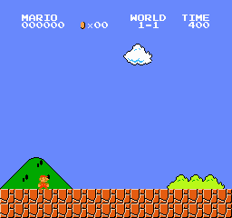
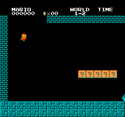
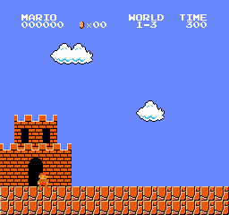
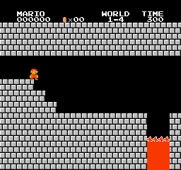

# Deep Reinforcement Learning aplicado a Super Mario Bros

Este proyecto tiene como objetivo el diseño, entrenamiento y validación de un agente inteligente capaz de superar de manera autónoma los niveles del videojuego **Super Mario Bros**, mediante técnicas de *Aprendizaje por Refuerzo Profundo (Deep Reinforcement Learning)*.

El entorno elegido es `SuperMarioBros-v0`, adaptado desde la librería `gym-super-mario-bros`, y el algoritmo central utilizado para el entrenamiento ha sido **Proximal Policy Optimization (PPO)**, uno de los métodos más robustos y eficientes de la familia *policy gradient*.

Este repositorio contiene todo lo necesario para **reproducir, analizar y extender** el entrenamiento de agentes tanto en niveles individuales como en configuraciones multinivel.

---

## 🧠 Motivación

Super Mario Bros constituye un entorno ideal para el aprendizaje por refuerzo profundo debido a su equilibrio entre complejidad, exploración, planificación y control fino. Entrenar un agente para resolver estos niveles implica abordar múltiples desafíos:

- Entornos visuales en tiempo real
- Acciones discretas combinadas (saltar, correr, avanzar)
- Recompensas esparsas o retardadas
- Obstáculos mortales y enemigos móviles
- Estructuras topológicas variadas (plataformas, túneles, castillos)

La solución propuesta explora tanto la optimización individual por nivel como el entrenamiento robusto generalista en entornos vectorizados.

---

## ⚙️ Arquitectura y diseño del entorno

El entorno base fue modificado mediante una serie de **wrappers personalizados** que permiten mejorar la calidad del entrenamiento y adaptarlo al algoritmo PPO:

- **Procesamiento de imágenes**: cada frame se convierte a escala de grises, se redimensiona a 84×84 y se normaliza.
- **Apilamiento de frames**: se combinan los últimos 4 frames en un tensor (4, 84, 84), lo que introduce información temporal al agente.
- **Repetición de acciones (ActionRepeat)**: la acción seleccionada se ejecuta varios pasos seguidos (parámetro configurable por nivel), simulando el comportamiento humano y estabilizando la política.
- **Función de recompensa personalizada**:
  - Recompensa positiva al alcanzar la bandera.
  - Penalización por inactividad o caídas.
  - Bonificación por recoger monedas o ganar altura vertical (eje Y).
  - Penalización si se muere sin llegar al objetivo.

Esta configuración permite al agente aprender no sólo a avanzar, sino a moverse estratégicamente para superar enemigos, evitar peligros y aprovechar el diseño del nivel.

---

## 🤖 Algoritmo de entrenamiento

El algoritmo **Proximal Policy Optimization (PPO)** ha sido elegido por sus propiedades:

- Estabilidad en la actualización de la política mediante *clipping*
- Soporte nativo para políticas estocásticas sobre espacios de acción discretos
- Eficiencia computacional en entornos visuales gracias al uso de mini-lotes y vectorización

Se ha implementado con la librería **Stable Baselines 3**, sobre política tipo `CnnPolicy`, con logs de entrenamiento integrados en TensorBoard.

Los hiperparámetros utilizados han sido:

 W-S | n_stes | n_epochs | batch_size |  lr  | gamma | lambda | ent_coeff | clip_range | n_envs | grad_clip_norm | N_FRAMES_REPEAT 
:---:|:------:|:--------:|:----------:|:----:|:-----:|:------:|:---------:|:----------:|:------:|:--------------:|:--------------:
 1-1 |  128   |    8     |     64     |2.5e-4|  0.9  |  0.98  |   0.01    |     0.2    |   16   |      0.5       |       4
 1-2 |  128   |    8     |     64     |2.5e-4|  0.95 |  0.95  |   0.01    |     0.2    |   16   |      0.5       |       8
 1-3 |  128   |    8     |     32     |2.5e-4|  0.95 |  0.98  |   0.02    |     0.2    |   16   |      0.5       |       4
 1-4 |  128   |    8     |     64     |2.5e-4|  0.9  |  0.95  |   0.01    |     0.2    |   16   |      0.5       |       4

---

## 🧪 Experimentos y niveles entrenados

Se han realizado entrenamientos específicos para los **cuatro niveles del Mundo 1** de Super Mario Bros, obteniendo resultados exitosos:

### Nivel 1-1 (Terreno inicial)
- Diseño horizontal, sin grandes obstáculos
- Entrenamiento completado en 2.1M pasos
- Comportamiento aprendido: correr y saltar sin detenerse, evitando enemigos innecesarios

### Nivel 1-2 (Subterráneo)
- Scroll rápido, túneles y enemigos continuos
- `action_repeat` incrementado a 8 para mantener aceleración
- Política aprendida: desplazamiento constante con saltos espaciados

### Nivel 1-3 (Puentes elevados)
- Plataformas suspendidas, enemigos voladores
- Añadida recompensa por ascenso en eje Y
- Mayor dificultad, requirió 3.9M pasos

### Nivel 1-4 (Castillo y jefe Bowser)
- Obstáculos lineales y enemigo final
- Resuelto con un modelo entrenado de forma más directa (entrenamiento corto)

---

## 🌐 Entrenamiento robusto multi-nivel

Además del enfoque por nivel, se diseñó un agente **multinivel** capaz de enfrentarse a todos los niveles del Mundo 1 simultáneamente:

- Se ejecutaron 16 entornos paralelos (4 réplicas por nivel) con `SubprocVecEnv`
- Se ajustó el parámetro `action_repeat` por nivel:
  - 1-1: 4
  - 1-2: 8
  - 1-3: 2
  - 1-4: 4
- Se incorporó una recompensa vertical para facilitar la exploración aérea en 1-3

Este enfoque logró **generalizar parcialmente**, alcanzando éxito completo en 1-1, 1-2 y 1-4. Sin embargo, el nivel 1-3 se mantuvo como un caso difícil debido a su diseño estructural de plataformas encadenadas.

  
  
  
   

## 📈 Evaluación

La evaluación se ha realizado en dos fases:

- **Cuantitativa**: usando `evaluate_policy()` para obtener métricas de recompensa media y desviación estándar.
- **Cualitativa**: renderizando el entorno sin wrappers vectorizados, observando el comportamiento del agente a 60 FPS reales.

Se incluyen vídeos grabados, logs de TensorBoard y los modelos entrenados en la carpeta `./best_model_robust`.

---

## 🔁 Reproducibilidad

Este proyecto proporciona:

- Todos los **scripts** de entrenamiento y evaluación (`train_robust.py`, `eval_robust.py`)
- Jupyter Notebook con ejemplo de entrenamiento individual (`mario_rl.ipynb`)
- Los parámetros utilizados para cada entorno (`LEVEL_ACTION_REPEAT`, etc.)
- Los modelos guardados y configuraciones de evaluación
- Registro de entrenamiento en TensorBoard (`./train/`)

Se puede obtener un archivo comprmido con todos los modelos resultantes y datos para poder obervar la evolución de los entrenamiento en el siguiente enlace: https://drive.google.com/file/d/1c3q6V3ezc4rBDGDn7XPWHbOVCe6nXIcM/view?usp=sharing

## 📚 Recursos utilizados

- [`gym-super-mario-bros`](https://github.com/Kautenja/gym-super-mario-bros)
- [`Stable-Baselines3`](https://stable-baselines3.readthedocs.io/)
- [`Gymnasium`](https://gymnasium.farama.org/)

---